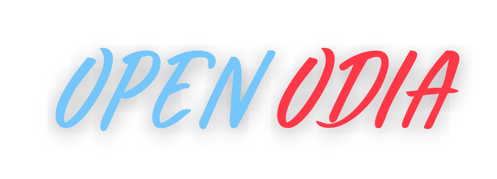

<h4 align="center">
  <a href="https://github.com/soumendrak/openodia/actions/workflows/codecov.yml"></a>
  <a href="https://github.com/psf/black/blob/main/LICENSE"></a>
  <a href="https://codecov.io/gh/soumendrak/openodia"></a>
  <a href="https://app.fossa.com/projects/git%2Bgithub.com%2Fsoumendrak%2Fopenodia?ref=badge_shield" alt="FOSSA Status"></a>
  <a href="https://pepy.tech/project/openodia" alt="downloads"></a>
</h4>

- `openodia` is a Python package which contains various tools on Odia language.
- The short term goal of this package is to not make state-of-the-art methods, but to make tools which work.

## Install

- Please install any Python 3 version. It should work. However, the library is tested in python 3.9 version.

```bash
pip install openodia
```

- If you want to directly build from the binary, please clone the repo and run `setup.py`.
```shell
git clone https://github.com/soumendrak/openodia.git
```

## Usage

For usage and further documentation please visit the [Documentation](https://openodia.soumendrak.com/) page. 

## License

<a align="center">
<a href="https://app.fossa.com/projects/git%2Bgithub.com%2Fsoumendrak%2Fopenodia?ref=badge_large" alt="FOSSA Status"></a>
</a>

## Caution

Thanks for being an early visitor.  
The library is in active development phase and not for production use.
